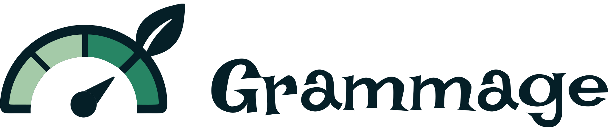

<div align="center">
  <picture>
    <source media="(prefers-color-scheme: dark)" srcset="assets/logo-white.svg">
    
  </picture>

  <h1>grammage</h1>

  <p>The GitLab CI template of Grammage, the eco-design audit that weighs the carbon footprint of a website on every merge request and certifies it in production with a signed badge.</p>

  <p>
    
    
  </p>
</div>

## What the job does

[Grammage](https://getgrammage.com) loads your pages in a real headless Chromium, records every
byte, request and DOM node, and turns them into a grade from A to F, an estimate in grams of CO₂ per
visit and a list of fixes ranked by the points they bring back. Its best-practice checks come from
the 115 web eco-design best practices of Green IT and from the French RGESN, and each finding names
the rule it refers to.

This repository holds the template only. It gives you three jobs to extend.

| Job                 | When                        | What it does                                                                                                                                       |
| ------------------- | --------------------------- | -------------------------------------------------------------------------------------------------------------------------------------------------- |
| `.grammage`         | on each merge request       | audits the preview, or the site built and started in the job, then posts the grade, the code quality findings and the metrics in the merge request |
| `.grammage-source`  | on each merge request       | reads the repository without a browser and points, file and line, to what will make the pages heavier, such as a 200 KB image or a font in TTF     |
| `.grammage-certify` | after the production deploy | measures the public site and sends the report to Grammage, which remeasures it and keeps the badge of the domain valid                             |

A threshold, a grade or a carbon budget, can fail the pipeline, so a merge request that makes the
site heavier is caught before it ships.

## Install

The Grammage image needs a license, which you get on [getgrammage.com](https://getgrammage.com/#tarifs).
Once you have it, add two masked CI/CD variables to your project or group.

- `GRAMMAGE_LICENSE`, the license token.
- `DOCKER_AUTH_CONFIG`, so the runner can pull the image:

```json
{ "auths": { "registry.solyzon.net": { "auth": "<base64 of username:license>" } } }
```

Then include the template in your `.gitlab-ci.yml` and extend the jobs you need.

```yaml
include:
    - remote: https://raw.githubusercontent.com/Solyzon/grammage/main/grammage.gitlab-ci.yml

grammage:
    extends: .grammage
    variables:
        GRAMMAGE_URL: https://preview.example.com/
        GRAMMAGE_CATEGORY: showcase
        GRAMMAGE_FAIL_UNDER: C

grammage:certify:
    extends: .grammage-certify
    rules:
        - if: $CI_COMMIT_BRANCH == $CI_DEFAULT_BRANCH
    variables:
        GRAMMAGE_URL: https://example.com/
        GRAMMAGE_SITE: '1'
```

The image is pulled with `pull_policy: always`, so `latest` follows each new version your license
covers. A self-hosted runner must therefore list `always` in its `allowed_pull_policies`.

## Main variables

| Variable              | Default                 | Role                                                                  |
| --------------------- | ----------------------- | --------------------------------------------------------------------- |
| `GRAMMAGE_URL`        | `PREVIEW_URL`           | the page to audit, or the start of the crawl with `GRAMMAGE_SITE`     |
| `GRAMMAGE_SITE`       |                         | any value audits the whole site, found by its sitemap or its links    |
| `GRAMMAGE_SERVE`      |                         | a command that builds and starts the site inside the job              |
| `GRAMMAGE_SERVE_URL`  | `http://127.0.0.1:4321` | where the site started by `GRAMMAGE_SERVE` answers                    |
| `GRAMMAGE_CATEGORY`   | `showcase`              | the grading category, or `auto` to infer it for each page             |
| `GRAMMAGE_DEVICE`     | `mobile`                | `mobile` or `desktop`                                                 |
| `GRAMMAGE_MODE`       | `normal`                | `fast`, `normal` or `full`, that is one, two or three runs per page   |
| `GRAMMAGE_FAIL_UNDER` |                         | the lowest grade, from A to F, or the lowest score that passes        |
| `GRAMMAGE_BUDGET`     |                         | a `budget.json` file of the repository with your own limits           |
| `GRAMMAGE_HTTP_AUTH`  |                         | `user:password` of a password protected preview, as a masked variable |
| `GRAMMAGE_VERSION`    | `latest`                | the image tag, `latest` or a fixed version                            |

The full list, the reports in the merge request and the protected pages are described in the
[CI/CD documentation](https://getgrammage.com/en/ci-cd-integration/).

## En français

Ce dépôt contient le modèle de job GitLab CI de Grammage, l'audit d'éco-conception de Solyzon qui
mesure vraiment l'empreinte carbone d'un site web à chaque demande de fusion, puis le fait vérifier
en production pour que son badge reste valide. On l'inclut dans son `.gitlab-ci.yml` en quelques
lignes, comme dans l'exemple plus haut, et le job publie ensuite dans la demande de fusion une note
de A à F, une estimation en grammes de CO₂ par visite et des conseils rangés par les points qu'ils
font gagner. Les bonnes pratiques vérifiées viennent des 115 bonnes pratiques d'écoconception web
de Green IT et du RGESN, c'est-à-dire le référentiel général d'écoconception de services numériques. L'image demande une licence, qu'on
prend sur [getgrammage.com](https://getgrammage.com/#tarifs), et la documentation complète se
trouve sur la page [intégration CI/CD](https://getgrammage.com/integration-ci-cd/).

## Authors

Designed and developed by **[Armand OCTEAU](https://github.com/Pomme978)** and
**[Sarah LÉVY](https://github.com/Saaaraaah14)** at [Solyzon](https://solyzon.com).

## License

The templates of this repository are released under the [MIT license](LICENSE). The Grammage image
they run is distributed under a separate commercial license.

<div align="center">
  <br>
  <a href="https://solyzon.com">
    
  </a>
  <p><sub>Designed and developed by Solyzon.</sub></p>
  <p><sub>© 2026 Solyzon. All rights reserved.</sub></p>
</div>
